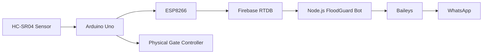

<div align="center">

# 🌊 FloodGuard WhatsApp Bot

### Real-time flood monitoring, alerts and cloud-connected emergency messaging


**The cloud messaging layer of the FloodGuard flood-monitoring ecosystem.**

</div>

---

## 🚨 What it does

FloodGuard connects physical water-level sensing hardware to a cloud-hosted WhatsApp notification service.

The bot reads real live state from Firebase and turns it into human-readable monitoring commands, transition alerts and gate-status notifications.

> The bot **monitors and reports**. Physical gate control remains on the FloodGuard hardware/controller side.

---

## 🏗️ System architecture



```text
HC-SR04
   ↓
Arduino Uno
   ↓
ESP8266
   ↓
Firebase RTDB /floodguard/live
   ↓
Node.js bot on AWS EC2
   ↓
Baileys
   ↓
WhatsApp alerts + monitoring commands
```

---

## ⚡ Core capabilities

- Real Firebase RTDB monitoring
- `SAFE`, `WARNING`, `DANGER` and `SENSOR_ERROR` states
- Transition-based warning and danger alerts
- Recovery notifications
- Gate countdown milestones
- Gate open / closed notifications
- Sensor-error reporting
- Stale-data protection
- ESP8266 network-status command
- Subscriber management
- QR linking page with live connection state
- Persistent WhatsApp linked-device authentication on EC2
- No fabricated sensor or rainfall readings

---

## 💬 Commands

| Command | Purpose |
|---|---|
| `menu` | Show available commands |
| `stats` | Current FloodGuard status |
| `water` | Water-level information |
| `risk` | Current flood-risk state |
| `gate` | Gate state / countdown |
| `devices` | Device information |
| `rain` | Rain-gauge state |
| `network` | ESP8266 / network status |
| `emergency` | Emergency information |
| `subscribe` | Subscribe to alerts |
| `unsubscribe` | Stop alert subscription |

---

## 🌊 Water-level logic

| Actual water level | State | Gate |
|---:|---|---|
| `< 8.5 cm` | `SAFE` | `CLOSED` |
| `8.5 cm – < 11 cm` | `WARNING` | `CLOSED` |
| `≥ 11 cm` | `DANGER` | 10-second countdown → `OPEN` |

Firebase uses:

- `water.levelCm` → actual calculated water level
- `water.distanceCm` → raw HC-SR04 air-gap measurement

---

## 🛡️ Reliability behavior

### Stale-data protection

`FLOODGUARD_STALE_MS` prevents old Firebase data from being treated as a current sensor reading.

### Sensor errors

Invalid sensor data moves the system into `SENSOR_ERROR` rather than inventing a valid reading.

### Alert transitions

Notifications are driven by meaningful state changes instead of repeatedly spamming the same alert on every database update.

---

## ☁️ AWS EC2 deployment

The production bot is designed to run under **PM2** on AWS EC2.

### Environment

```env
PORT=8080
DATA_PATH=/data
FIREBASE_DATABASE_URL=YOUR_FIREBASE_RTDB_URL
FIREBASE_AUTH=
FLOODGUARD_STALE_MS=15000
```

> Never commit real secrets, credentials or authentication data to the repository.

### Install / update

```bash
cd ~/floodguard-whatsapp-bot
git pull origin main
npm ci --omit=dev || npm install --omit=dev
npm run check
pm2 restart floodguard-whatsapp-bot --update-env
pm2 save
```

Useful checks:

```bash
pm2 status
pm2 logs floodguard-whatsapp-bot --lines 50
```

Expected healthy logs include WhatsApp and Firebase connection confirmation.

---

## 🔐 Preserve WhatsApp authentication

Production uses:

```text
DATA_PATH=/data
/data/auth
```

**Do not delete `/data` or `/data/auth` during deployment.**

Those files preserve the linked-device session so the server does not require a new QR scan after every update.

---

## 📱 QR setup page

The setup page on the configured HTTP port:

- checks connection status automatically
- displays newly generated QR codes
- hides expired display QR codes
- shows a waiting state while WhatsApp generates a replacement
- switches to a connected state after successful linking
- displays WhatsApp and Firebase status

`QR_DISPLAY_TTL_MS` controls display lifetime only. New QR codes still come from the real WhatsApp/Baileys connection flow.

---

## 🧩 FloodGuard ecosystem

This repository is one component of a larger project that includes:

- Arduino-based flood sensing
- ESP8266 connectivity
- Firebase real-time data
- automated gate behavior
- mobile / web monitoring interfaces
- cloud-hosted notification services

---

<div align="center">

### Sense → Detect → Alert → Respond

**Built by Poojana Kaveesh as part of the FloodGuard project.**

</div>
