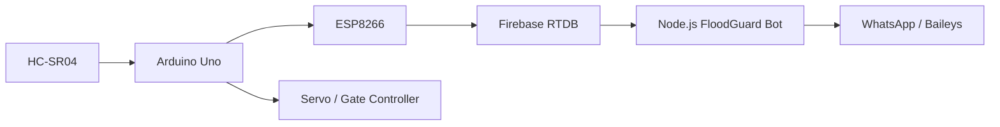

<div align="center">

# 🌊 FloodGuard WhatsApp Bot

### Real-time flood monitoring, cloud alerts and emergency-status messaging


[](https://github.com/teldigi5-wq/floodguard-whatsapp-bot/actions/workflows/ci.yml)

**The cloud-notification layer of the FloodGuard IoT flood-monitoring ecosystem.**

</div>

---

## 🎯 Project snapshot

FloodGuard connects real water-level sensing hardware to Firebase and a cloud-hosted WhatsApp service so users can query system state and receive meaningful alerts when flood conditions change.

This repository focuses on the **monitoring and notification layer**. Physical gate control remains on the embedded controller side.

| Layer | Technology |
|---|---|
| Sensing | HC-SR04 ultrasonic sensor |
| Controller | Arduino Uno |
| Connectivity | ESP8266 |
| Realtime backend | Firebase RTDB |
| Messaging service | Node.js + Baileys |
| Hosting | AWS EC2 + PM2 |
| User channel | WhatsApp |

---

## ✅ Validation and deployment

FloodGuard now separates **code validation** from **production deployment**.

The CI workflow runs on pushes and pull requests and verifies the project with Node.js 20, a clean `npm ci` install, the repository's syntax/source checks, and required-file validation before changes are treated as healthy.

Production deployment remains handled by the dedicated EC2 workflow, which updates the running service and preserves the deployment model independently from pull-request validation.

This gives the repository two clear signals:

- **CI** — proves the source tree is syntactically valid and structurally complete on a clean runner.
- **Deployment** — updates the AWS EC2 service after accepted changes reach `main`.

---

## 🏗️ End-to-end architecture



```text
Water level
   ↓
HC-SR04 sensor
   ↓
Arduino Uno
   ↓
ESP8266
   ↓
Firebase RTDB
   ↓
AWS EC2 Node.js bot
   ↓
WhatsApp commands + alerts
```

---

## ⚡ Core capabilities

- Real-time Firebase RTDB monitoring
- `SAFE`, `WARNING`, `DANGER` and `SENSOR_ERROR` states
- Transition-based warning and danger alerts
- Recovery notifications
- Gate countdown milestones and gate-state reporting
- Stale-data protection
- Sensor-error reporting
- ESP8266/network-status reporting
- Subscriber management
- QR-based WhatsApp device linking
- Persistent authentication storage on EC2
- PM2 process management
- No fabricated sensor or rainfall readings

---

## 💬 WhatsApp command surface

| Command | Purpose |
|---|---|
| `menu` | Show available commands |
| `stats` | Current FloodGuard status |
| `water` | Water-level information |
| `risk` | Current flood-risk state |
| `gate` | Gate state / countdown |
| `devices` | Device information |
| `rain` | Rain-gauge status |
| `network` | ESP8266 / network status |
| `emergency` | Emergency information |
| `subscribe` | Subscribe to alerts |
| `unsubscribe` | Stop alert subscription |

---

## 🛡️ Reliability design

### Stale data

`FLOODGUARD_STALE_MS` prevents an old Firebase record from being presented as a fresh sensor reading.

### Sensor errors

Invalid or unavailable readings become `SENSOR_ERROR` instead of being converted into a fake safe/warning/danger value.

### Transition alerts

The bot responds to meaningful state transitions instead of spamming the same warning every time Firebase updates.

### Authentication persistence

The WhatsApp linked-device session is stored outside the source tree so application updates do not force a new QR scan every time.

---

## 🔄 Data flow

Firebase exposes live FloodGuard state under the project data path. The bot converts that state into user-facing status and alerts.

Important values include:

```text
water.levelCm      calculated water level
water.distanceCm   raw ultrasonic air-gap distance
gate               current gate state
alarm              alarm state
esp8266            network/device state
system             overall system state
```

The bot treats Firebase as the live communication boundary between the embedded hardware and the cloud messaging service.

---

## ☁️ AWS EC2 deployment

The production service is intended to run under **PM2** on AWS EC2.

### Example environment

```env
PORT=8080
DATA_PATH=/data
FIREBASE_DATABASE_URL=YOUR_FIREBASE_RTDB_URL
FIREBASE_AUTH=
FLOODGUARD_STALE_MS=15000
```

> Never commit production secrets, credentials, `.env` files or WhatsApp authentication data.

### Install / update

```bash
cd ~/floodguard-whatsapp-bot
git pull origin main
npm ci --omit=dev || npm install --omit=dev
npm run check
pm2 restart floodguard-whatsapp-bot --update-env
pm2 save
```

### Health checks

```bash
pm2 status
pm2 logs floodguard-whatsapp-bot --lines 50
```

Healthy operation should show successful WhatsApp and Firebase connectivity.

---

## 🔐 Preserve linked-device authentication

Production uses:

```text
DATA_PATH=/data
/data/auth
```

**Do not delete `/data` or `/data/auth` during deployment.**

Keeping authentication outside the repository allows source updates without destroying the linked WhatsApp session.

---

## 📱 QR setup page

The setup page can:

- poll connection state automatically
- display newly generated QR codes
- hide expired displayed codes
- show a waiting state while WhatsApp generates the next QR
- switch to a connected state after linking
- expose WhatsApp and Firebase connection status

`QR_DISPLAY_TTL_MS` controls display lifetime only; new QR values still originate from the real Baileys/WhatsApp connection process.

---

## 🌐 FloodGuard ecosystem

This repository is one part of a larger system that includes:

- embedded water-level sensing
- Arduino control logic
- ESP8266 connectivity
- Firebase real-time synchronization
- automated gate behavior
- buzzer / LED / LCD alerts
- mobile and web monitoring interfaces
- AWS-hosted WhatsApp notifications

That full path makes FloodGuard useful as a portfolio example of **IoT → cloud → user communication** rather than just an isolated bot.

---

## 💼 What this project demonstrates

- embedded-to-cloud system integration
- realtime database consumption
- event/state transition design
- reliability around stale and invalid sensor data
- Node.js service deployment
- process management with PM2
- persistent authentication handling
- messaging UX for an IoT system
- separation of CI validation from production deployment

---

## 🗺️ Next upgrades

- [ ] Add automated tests around state transitions and stale-data behavior
- [ ] Add structured health/readiness endpoints for deployment monitoring
- [ ] Add screenshots of the QR setup page and WhatsApp command responses
- [ ] Add a complete FloodGuard architecture diagram spanning hardware, Firebase, web, mobile and messaging
- [ ] Add versioned releases and deployment notes

---

<div align="center">

### Sense → Detect → Alert → Respond

**Built by Poojana Kaveesh as part of the FloodGuard project.**

</div>
